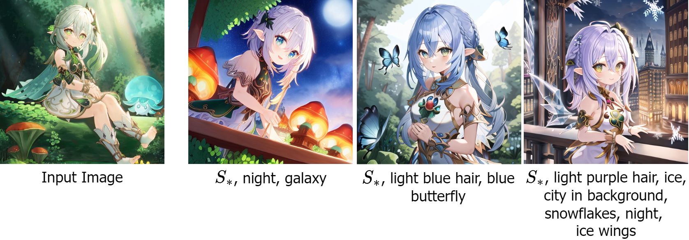
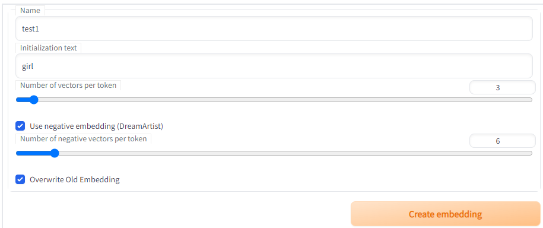
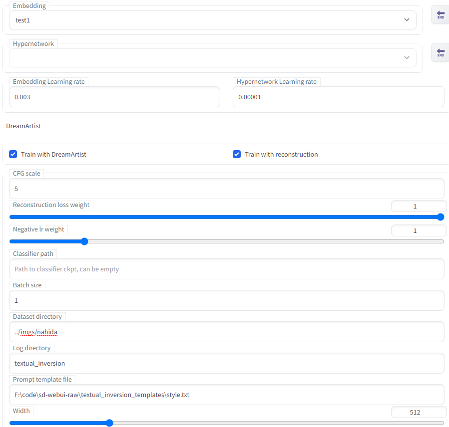
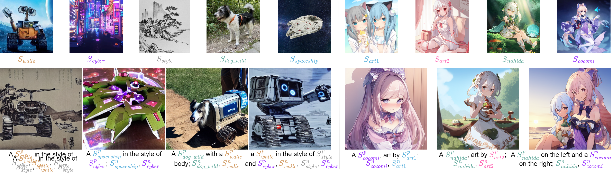

# DreamArtist
This repo is the official PyTorch implementation of ***"DreamArtist: Towards Controllable One-Shot Text-to-Image Generation via Contrastive Prompt-Tuning"*** 
with [Stable-Diffusion-webui](https://github.com/AUTOMATIC1111/stable-diffusion-webui).

***Stable-Diffusion-webui Extension Version :*** [DreamArtist-sd-webui-extension](https://github.com/7eu7d7/DreamArtist-sd-webui-extension)

Everyone is an artist. Rome wasn't built in a day, but your artist dreams can be!

With just ***one*** training image DreamArtist learns the content and style in it, generating diverse high-quality images with high controllability.
Embeddings of DreamArtist can be easily combined with additional descriptions, as well as two learned embeddings.




# Setup and Running

Clone this repo.
```bash
git clone https://github.com/7eu7d7/DreamArtist-stable-diffusion
```

Following the [instructions of webui](https://github.com/AUTOMATIC1111/stable-diffusion-webui#automatic-installation-on-windows) to install.

## Training

First create the positive and negative embeddings in ```Create Embedding``` Tab.


Then, select positive embedding and set the parameters and image folder path in the ```Train``` Tab to start training.
The corresponding negative embedding is loaded automatically.
If your VRAM is low or you want save time, you can uncheck the ```reconstruction```.



## Tested models (need ema version):
+ Stable Diffusion v1.5
+ animefull-latest
+ Anything v3.0

# Style Clone


# Prompt Compositions


# Other Results

