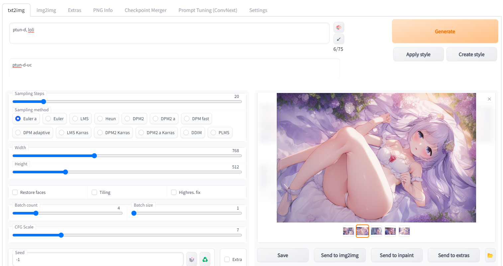
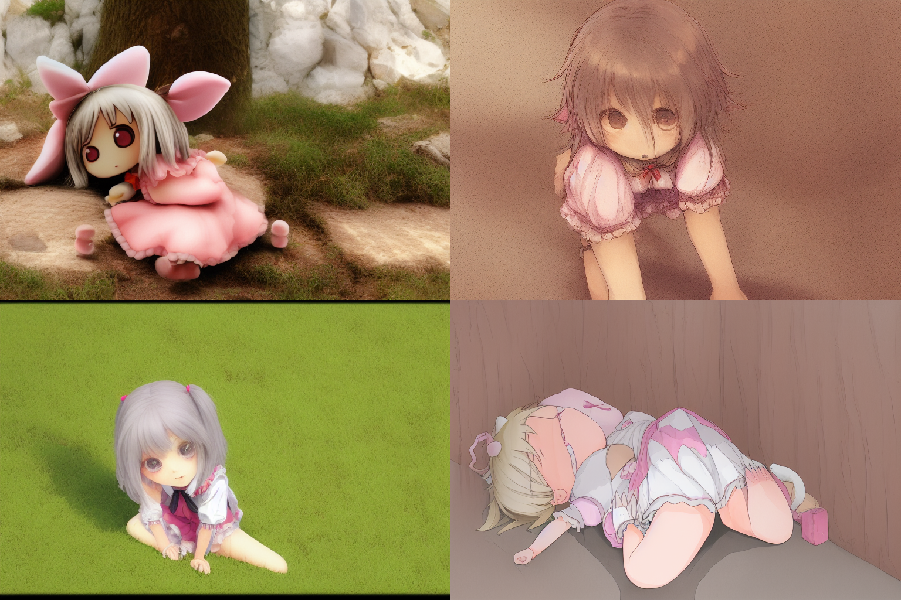

# Stable Diffusion web UI (Advance Prompt Tuning)
基于[Stable Diffusion web UI](https://github.com/AUTOMATIC1111/stable-diffusion-webui)魔改。

APT-prompt, 每一张都是壁纸！


优化prompt tuning，添加如下算法：
+ 添加负面词条的prompt embedding学习，大幅提高生成图像质量。可以仅从单张图像学习(one-shot learning)
+ 添加重建损失，提高生成图像的细节质量和丰富程度。
+ 增加基于模型的prompt tuning。基于我之前开发的[AI p站爬虫](https://github.com/7eu7d7/pixiv_AI_crawler)中
训练的convnext模型，用另一个AI评估生成图像质量，作为判别器辅助模型训练。可以让prompt学会高质量这一概念，或是学会你的xp。


# 使用方法

在创建embedding时，需要分别创建正面和负面的```{name}```和```{name}-uc```，建议大小分别为3和10。
训练prompt tuning时，选择正面prompt ```{name}```

其他使用方法与原版一致，prompt tuning训练过程可以选择是否加载判别器模型。
训练判别器或使用现有判别器见[AI p站爬虫](https://github.com/7eu7d7/pixiv_AI_crawler)。


# 效果对比

APT-prompt tuning: (prompt: ptun-cnx, loli;  negtive: ptun-cnx-uc)


webui prompt tuning: (prompt: ptun-webui, loli;  negtive: None)


no prompt tuning: (prompt: loli;  negtive: None)
